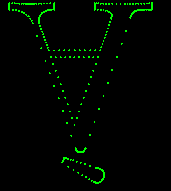

# ☔️ yyfont.hpp

An almost single-header but modular font parser written in moderately modern c++.



### Load things easily.

```cpp
if (const auto &test_font = Font::fromPath("samples/nj.ttf"))
{
    // Get internal ID's for unicode code points.
    Font::GlyphIndex gi = test_font->getId("字");
    // Access any properties about them.
    Font::GlyphMetrics gm = test_font->getMetrics(gi);
    // Or get their curves too 😏.
    Font::Glyph letter = test_font->getGlyph(gi)
}
```

### Register new formats

There are allways obscurer formats out there. If you're brave enough, go ahead and extend the system!

```cpp
class JairoFragmentsFont : Font
{
    public:
        // Tries to load a font of your type. If it fails, it should return nullptr.
        static std::shared_ptr<Font> Loader(const void *mem, size_t size) { ... }
};
```
**NOTE: You don't own the given memory, if you need something, copy it please 😊**

```cpp
// Register your new loader.
Font::FontLoaderFactory::registerLoader( JairoFragmentsFont::Loader );
// & without aditional format madness, that's it.
const auto &test_font = Font::fromPath("samples/font.jfp")
```

The factory will try to load a file with every loader until any claims it.

### License

Do whatever you want with this, I don't give a.. [Mit License](LICENSE)

### Resources

- Online font inspector: [FontDrop](https://fontdrop.info/)
- TrueType spec (Apple): [TrueType Reference Manual](https://developer.apple.com/fonts/TrueType-Reference-Manual/)
- OpenType spec (Microsoft): [OpenType® Specification Version 1.9.1](https://www.microsoft.com/typography/otspec/)
- WTF opentype with a font inside a font: [The Compact Font Format Specification](https://adobe-type-tools.github.io/font-tech-notes/pdfs/5176.CFF.pdf)

#### Protect chocobos worldwide 🐥